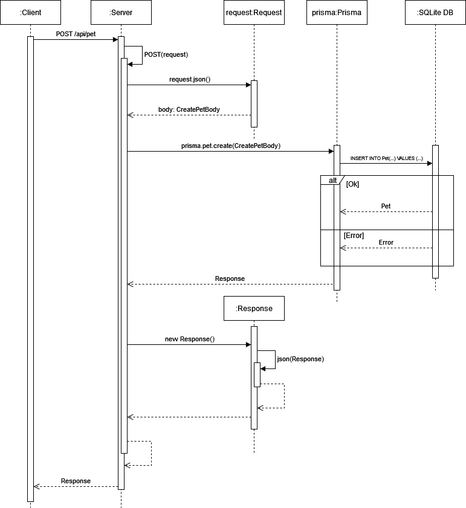

### API Documentation for `PetScale`

This document provides an overview of the API endpoints, methods, request formats, and responses.

## Endpoints Overview
### Weight (`/weight`)
- **GET**: Fetch all weight records.
- **POST**: Create a new weight record.
- **PUT** (by `weightId`): Update a specific weight record.
- **GET** (by `weightId`): Fetch a specific weight record.
- **DELETE** (by `weightId`): Delete a specific weight record.

### Pet (`/pet`)
- **GET**: Fetch all pets.
- **POST**: Create a new pet.
- **PUT** (by `petId`): Update a specific pet.
- **GET** (by `petId`): Fetch a specific pet.
- **DELETE** (by `petId`): Delete a specific pet.

## Endpoint Details

### Weight (`/weight`)

#### **GET** `/weight`
Fetch all weight records.

- **Response Example**:
```json
{
  "message": "Successfully queried weights data.",
  "data": [
    {
      "id": "weightId1",
      "weight": 12.5,
      "date": "2024-01-01T00:00:00Z",
      "petId": "petId1"
    }
  ]
}
```

---

#### **POST** `/weight`
Create a new weight record.

- **Request Body**:
```json
{
  "weight": 12.5,
  "date": "2024-01-01",
  "petId": "petId1"
}
```

- **Response Example**:
```json
{
  "message": "Weight entry has been successfully created.",
  "data": {
    "id": "weightId1",
    "weight": 12.5,
    "date": "2024-01-01T00:00:00Z",
    "petId": "petId1"
  }
}
```
For a visual representation of the POST `/api/pet` flow, refer to the sequence diagram below:




#### **PUT** `/weight/[weightId]`
Update a specific weight record.

- **Request Body**:
```json
{
  "weight": 13.0,
  "date": "2024-01-15"
}
```

- **Response Example**:
```json
{
  "message": "Successfully updated weight data.",
  "data": {
    "id": "weightId1",
    "weight": 13.0,
    "date": "2024-01-15T00:00:00Z",
    "petId": "petId1"
  }
}
```

#### **GET** `/weight/[weightId]`
Fetch a specific weight record.

- **Response Example**:
```json
{
  "message": "Successfully queried weight data.",
  "data": {
    "id": "weightId1",
    "weight": 12.5,
    "date": "2024-01-01T00:00:00Z",
    "petId": "petId1"
  }
}
```

#### **DELETE** `/weight/[weightId]`
Delete a specific weight record.

- **Response Example**:
```json
{
  "message": "Successfully deleted weight entry.",
  "data": {}
}
```

### Pet (`/pet`)

#### **GET** `/pet`
Fetch all pets.

- **Response Example**:
```json
{
  "message": "Successfully queried pets data.",
  "data": [
    {
      "id": "petId1",
      "name": "Buddy",
      "species": "Dog",
      "breed": "Labrador",
      "birthDate": "2020-01-01",
      "userId": "defaultUserId"
    }
  ]
}
```

#### **POST** `/pet`
Create a new pet.

- **Request Body**:
```json
{
  "userId": "defaultUserId",
  "name": "Buddy",
  "species": "Dog",
  "breed": "Labrador",
  "birthDate": "2020-01-01"
}
```

- **Response Example**:
```json
{
  "message": "Pet has been successfully created.",
  "data": {
    "id": "petId1",
    "name": "Buddy",
    "species": "Dog",
    "breed": "Labrador",
    "birthDate": "2020-01-01",
    "userId": "defaultUserId"
  }
}
```

#### **PUT** `/pet/[petId]`
Update a specific pet.

- **Request Body**:
```json
{
  "name": "Buddy",
  "species": "Dog",
  "breed": "Golden Retriever",
  "birthDate": "2020-01-01"
}
```

- **Response Example**:
```json
{
  "message": "Successfully updated pet data.",
  "data": {
    "id": "petId1",
    "name": "Buddy",
    "species": "Dog",
    "breed": "Golden Retriever",
    "birthDate": "2020-01-01",
    "userId": "defaultUserId"
  }
}
```

#### **GET** `/pet/[petId]`
Fetch a specific pet.

- **Response Example**:
```json
{
  "message": "Successfully queried pet data.",
  "data": {
    "id": "petId1",
    "name": "Buddy",
    "species": "Dog",
    "breed": "Labrador",
    "birthDate": "2020-01-01",
    "userId": "defaultUserId"
  }
}
```

#### **DELETE** `/pet/[petId]`
Delete a specific pet.

- **Response Example**:
```json
{
  "message": "Successfully deleted pet.",
  "data": {}
}
```

### Deprecated Endpoint: User (`/user`)
This endpoint is deprecated as the application now uses a single default user. Direct manipulation of users may still be supported but will not be documented.

- **GET** `/user`: Fetch all users.
- **POST** `/user`: Create a new user.
- **GET** `/user/[userId]`: Fetch a specific user.
- **PUT** `/user/[userId]`: Update a specific user.
- **DELETE** `/user/[userId]`: Delete a specific user.

---

### Notes
1. **Default User**: All pets and weights must reference the default user.
2. **Error Handling**: Each endpoint provides meaningful error messages with HTTP status codes.
3. **Dates**: Ensure dates are in ISO 8601 format (`YYYY-MM-DDTHH:mm:ss.sssZ`) for consistency.
