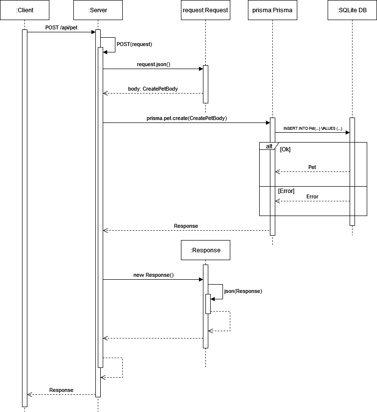

[PROJECT DOCUMENTATION](DOCUMENTATION.md) | [API DOCUMENTATION](API.md)

# 🐕⚖️ PetScale

**PetScale** is a simple and interactive weight tracking application for pet owners. It provides insightful metrics and recommendations based on the weight trends of pets. The app is designed with a clean interface for tracking, adding, and deleting pet weight data efficiently.


## Features ✨

1. **Dynamic Weight Tracking**:
   - Track weight trends for individual pets.
   - View detailed weight charts with time-series data.

2. **Pet-Specific Analytics**:
   - Key Performance Indicators (KPIs) for each pet:
     - Min Weight
     - Max Weight
     - Average Weight
     - Weight Range
     - Recommendations for improving pet health.

3. **CRUD Operations**:
   - Add, update, and delete pets.
   - Log weight entries for pets.
   - Manage historical weight records.

4. **Scalable API**:
   - RESTful API endpoints for interacting with users, pets, and weights data.
   - Supports JSON requests and responses.


## Tech Stack 🛠️

### Frontend:
- **React**: Interactive UI components.
- **Next.js**: Server-side rendering and routing.
- **Tailwind CSS**: Modern styling framework.
- **shadcn/ui**: Styling templates 

### Backend:
- **Prisma**: ORM for database operations.
- **SQLite**: Lightweight database for development and production.
- **Node.js**: Server environment.


## API Endpoints 📡

### Weight Endpoints:
| Method | Endpoint                 | Description                         |
|--------|--------------------------|-------------------------------------|
| `GET`  | `/weight`                | Fetch all weight records.           |
| `POST` | `/weight`                | Create a new weight record.         |
| `GET`  | `/weight/[weightId]`     | Fetch a specific weight record.     |
| `PUT`  | `/weight/[weightId]`     | Update a specific weight record.    |
| `DELETE` | `/weight/[weightId]`   | Delete a specific weight record.    |

### Pet Endpoints:
| Method | Endpoint              | Description                       |
|--------|-----------------------|-----------------------------------|
| `GET`  | `/pet`                | Fetch all pets.                   |
| `POST` | `/pet`                | Create a new pet.                 |
| `GET`  | `/pet/[petId]`        | Fetch a specific pet.             |
| `PUT`  | `/pet/[petId]`        | Update a specific pet.            |
| `DELETE` | `/pet/[petId]`      | Delete a specific pet.            |

For a visual representation of the POST `/api/pet` flow, refer to the sequence diagram below:




## Project Setup 🚀

### Prerequisites
- Node.js (>= 18.x)
- pnpm (>= 9.12.x)

### Installation
1. Clone the repository:
   ```bash
   git clone https://github.com/your-username/petscale.git
   cd petscale
   ```

2. Install dependencies:
   ```bash
   pnpm install
   ```

3. Generate the Prisma client:
   ```bash
   pnpm prisma:generate
   ```

4. Push the Prisma schema to the database:
   ```bash
   pnpm prisma db push
   ```

## Running the Application 🏃‍♂️

### Development Mode
Run the app locally:
```bash
pnpm dev
```

### Production Mode
Build and start the production server:
```bash
pnpm build
pnpm start
```

## Unit Tests 🧪

The project includes unit tests for critical functionalities:

- **Location**: `lib/analytics.test.ts`
- **Testing Framework**: [Vitest](https://vitest.dev/)

### Running Unit Tests
```bash
pnpm test
```

## How to Use 🐕🐈

1. **Track Weight**:
   - Use the `Track Weight` button to log your pet's weight.
2. **Add Pet**:
   - Add a new pet by clicking the `Add Pet` button.
3. **Delete Pet**:
   - Remove a pet using the `Delete Pet` button. All associated weight data will also be deleted.

## Folder Structure 🗂️

```plaintext
.
├── API.md
├── api-testing
│   ├── OSZIMT-LF12
│   │   ├── Pet/
│   │   ├── User/
│   │   └── Weight/
├── app
│   ├── api/
│   ├── components/
│   ├── lib/
├── prisma/
├── tests/
```

- **API Documentation**: Detailed in `API.md`.
- **Unit Tests**: Available in `lib/analytics.test.ts`.
- **Integration Tests**: Bruno-compatible files in `api-testing/OSZIMT-LF12`.


## Contributors 🤝

- **Torben Haack** - *Developer*
- **ChatGPT** - *Used for assistance in writing documentation*